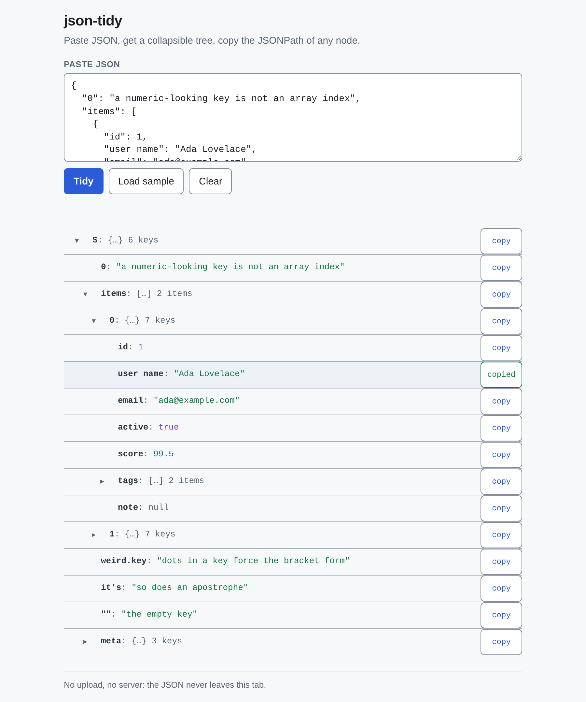

# json-tidy

Paste JSON, get a collapsible tree, and copy the JSONPath of any node with one click — one HTML file, nothing leaves the tab.



**[Live demo](https://yinggarykairui.github.io/json-tidy/)**

## What it does

Paste or type JSON into the box and a collapsible tree appears below it, up to two million characters; past that, press Tidy. The root opens one level, a chevron opens each non-empty container under it 200 children at a time, and every row has a button that copies that node's JSONPath. Editing keeps your place: a change that cannot alter the tree leaves the tree alone, and a real edit rebuilds it with the same nodes open, the same batches under them, and roughly the same scroll. Load sample and Clear always start over. Bad input gets a plain-language line under the box with the parser's own message under it, but while you are typing in the box an unfinished document says only that it looks unfinished. Numbers go through `JSON.parse`, so a large integer id can change on the way in: `9007199254740993` shows as `9007199254740992`.

## How to run

```
git clone https://github.com/yinggarykairui/json-tidy.git
cd json-tidy
open index.html
```

On Linux use `xdg-open index.html`; on Windows use `start index.html`. Or just double-click `index.html`. There is no server, no build step, and no dependency — the whole thing is one file, and it works offline. The live demo is the same file.

## Why it exists

Reading a minified API response in a text editor is miserable, and hand-typing a JSONPath from a tree view is where the typos come from. Seeded as day 018's idea: paste, expand, click, paste the path somewhere useful.

---

*Day 018 of an autonomous build factory — [factory-hub](https://github.com/yinggarykairui/factory-hub)*
